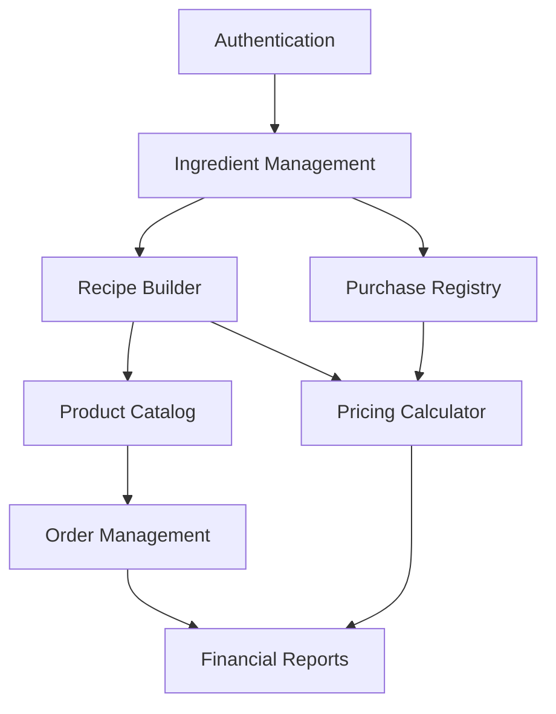

# BakeFlow ERP - Feature Documentation

## Overview

This directory contains comprehensive documentation for individual features in the BakeFlow ERP system. Each feature is documented with complete implementation details, technical specifications, and deployment instructions optimized for LLM agent development.

## Documentation Structure

Each feature documentation includes:

- **Business Context**: User stories, requirements, and business value
- **Technical Specification**: Data models, architecture, and implementation plan
- **UI/UX Design**: Interface mockups, user flows, and design requirements
- **Security Implementation**: Authentication, authorization, and data protection
- **Testing Strategy**: Unit, widget, and integration testing approaches
- **Performance Considerations**: Optimization strategies and monitoring
- **Deployment Instructions**: Step-by-step deployment and rollback procedures
- **LLM Agent Context**: Implementation continuation points and troubleshooting

## Feature Status

### Phase 1: Foundation (MVP)
- **[Ingredient Management](ingredient-management.md)** - 🚧 Example/Template - Complete CRUD operations for ingredient inventory
- **Recipe Builder** - 📋 Planned - Recipe creation with ingredient linking and cost calculation
- **Product Catalog** - 📋 Planned - Product management with recipe integration
- **Purchase Registry** - 📋 Planned - Receipt tracking and price updates
- **Pricing Calculator** - 📋 Planned - Cost analysis and margin calculation

### Phase 2: Operations
- **Order Management** - 📋 Future - Customer orders and production planning
- **Inventory Tracking** - 📋 Future - Stock levels and reorder alerts
- **Financial Reports** - 📋 Future - Business analytics and performance metrics

### Phase 3: Growth
- **Multi-location Support** - 📋 Future - Multiple bakery locations
- **Advanced Analytics** - 📋 Future - Business intelligence and insights
- **Third-party Integrations** - 📋 Future - External service connections

## Status Legend

- ✅ **Completed**: Feature implemented, tested, and deployed
- 🚧 **In Development**: Feature currently being implemented
- 📋 **Planned**: Feature documented and ready for implementation
- 🔄 **In Review**: Feature implemented and under review
- ⚠️ **Blocked**: Feature blocked by dependencies or issues
- 🔧 **Maintenance**: Feature in maintenance or bug-fix mode

## Documentation Template

Use the [Ingredient Management](ingredient-management.md) documentation as a template for creating new feature documentation. This template includes:

### Required Sections
1. **Feature Overview**: ID, name, priority, status, business context
2. **Technical Specification**: Data models, architecture, file structure
3. **Implementation Plan**: Phased development approach with priorities
4. **UI/UX Design**: Interface requirements and user experience
5. **Security Implementation**: Authentication, authorization, data protection
6. **Testing Strategy**: Comprehensive testing approach
7. **Performance Considerations**: Optimization and monitoring strategies
8. **Error Handling**: Error types, handling, and recovery procedures
9. **LLM Agent Context**: Implementation context and continuation points
10. **Deployment Instructions**: Step-by-step deployment and rollback

### Documentation Guidelines
- Use clear, structured YAML blocks for status and configuration
- Include complete Dart code examples for models and services
- Provide specific file paths and directory structures
- Document security rules and validation patterns
- Include comprehensive testing examples
- Add LLM-specific context for autonomous development
- Provide deployment and rollback procedures

## Feature Dependencies

### Common Dependencies
- **Authentication System**: Required for all features
- **Business Context Provider**: Multi-tenant data isolation
- **Error Handling System**: Consistent error management
- **Design System**: UI components and styling
- **State Management**: Riverpod providers and state handling

### Feature Interconnections

## Development Workflow

### Feature Development Process
1. **Planning**: Review business requirements and create feature documentation
2. **Design**: Create UI mockups and technical architecture
3. **Implementation**: Develop feature following MVVM pattern
4. **Testing**: Implement comprehensive test suite
5. **Review**: Code review and quality assurance
6. **Deployment**: Deploy to production with monitoring
7. **Maintenance**: Monitor, fix issues, and iterate

### Documentation Maintenance
- Update feature status as development progresses
- Add implementation notes and lessons learned
- Document any architecture changes or decisions
- Update dependency information
- Maintain deployment and troubleshooting guides

## Quality Standards

### Code Quality
- Follow SOLID principles and clean architecture
- Implement comprehensive error handling
- Add security validation and authorization
- Include accessibility features
- Optimize for performance and scalability

### Documentation Quality
- Provide complete implementation context
- Include practical code examples
- Document all dependencies and prerequisites
- Add troubleshooting and error recovery guides
- Maintain up-to-date status information

### Testing Requirements
- Unit tests for business logic (90%+ coverage)
- Widget tests for UI components
- Integration tests for complete workflows
- Performance tests for critical paths
- Security tests for authentication and authorization

## Resources

### Development Resources
- [Development Workflow](../development-workflow.md): Development standards and processes
- [Project Structure](../project-structure.md): Architecture and code organization
- [Design Guidelines](../design-guidelines.md): UI/UX design system
- [MCP Usage Guide](../mcp.md): Model Context Protocol for documentation access

### External Resources
- [Flutter Documentation](https://docs.flutter.dev/): Flutter framework documentation
- [Firebase Documentation](https://firebase.google.com/docs): Firebase services documentation
- [Riverpod Documentation](https://riverpod.dev/): State management documentation
- [Material Design 3](https://m3.material.io/): Design system guidelines

## Contributing

### Adding New Features
1. Create feature documentation using the template
2. Define clear business requirements and user stories
3. Design technical architecture and data models
4. Plan implementation phases and priorities
5. Document testing and deployment strategies
6. Add LLM agent context for autonomous development

### Updating Existing Features
1. Update feature status and implementation progress
2. Add new requirements or scope changes
3. Document architecture changes and decisions
4. Update testing and deployment procedures
5. Add troubleshooting and error recovery information

This feature documentation structure ensures comprehensive coverage of all aspects needed for successful feature development, deployment, and maintenance in the BakeFlow ERP system.